# Embedded Design Project: Augmented Reality Glass Plugin Board

## Project Overview
The AR Glass Plugin Board is an innovative solution designed to tranform any traditional glass to a AR based smart glass.

### Key Features:
1. **Energy Efficiency**: Achieved power consumption under 38 mW without sacrificing GNSS performance.
2. **Precision and Availability**: Ensured maximum position availability with four concurrent GNSS receptions using u-blox SAM-M10Q-00B.
3. **User-Centric Design**: Developed a minimalist GUI for an Tranparent Display for intuitive user experience.
4. **Advanced Detection**: Integrated precise movement detection using MPU 6050 gyrosensor for accurate performance.
5. **Robust Protection**: Implemented EMC/EMI immunity, reverse voltage, safe in-circuit charging, and ESD protection, along with overcharging protection to ensure reliability.
6. **OTA Updates**: Implemented a WiFi-based Over-the-Air firmware upgrade feature.
7.  **Firmware**: Implemented Object Oriented Programming appraoch.

## PCB Design and Visuals

### Schematic
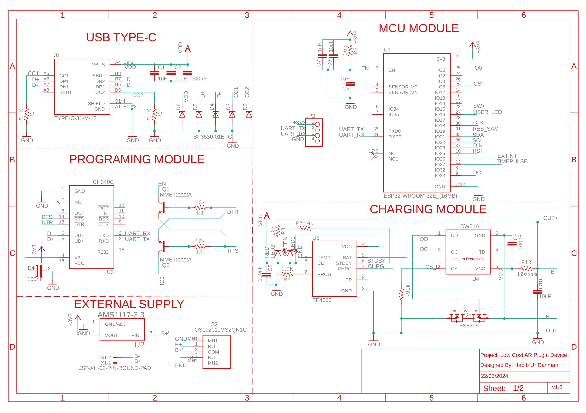
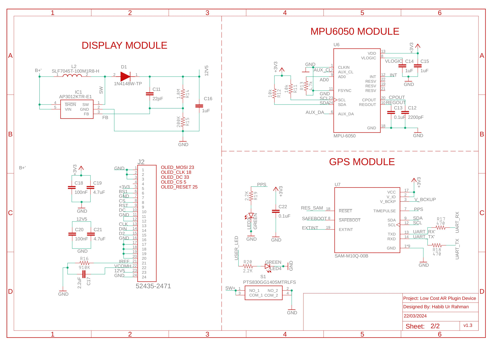

### PCB Layout
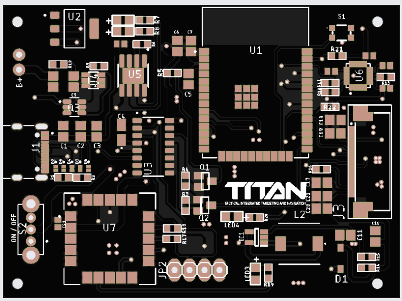
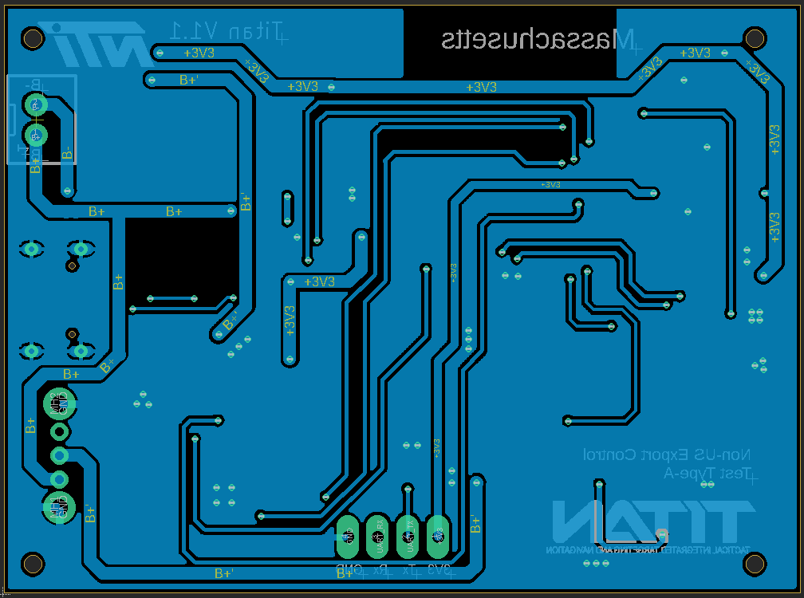
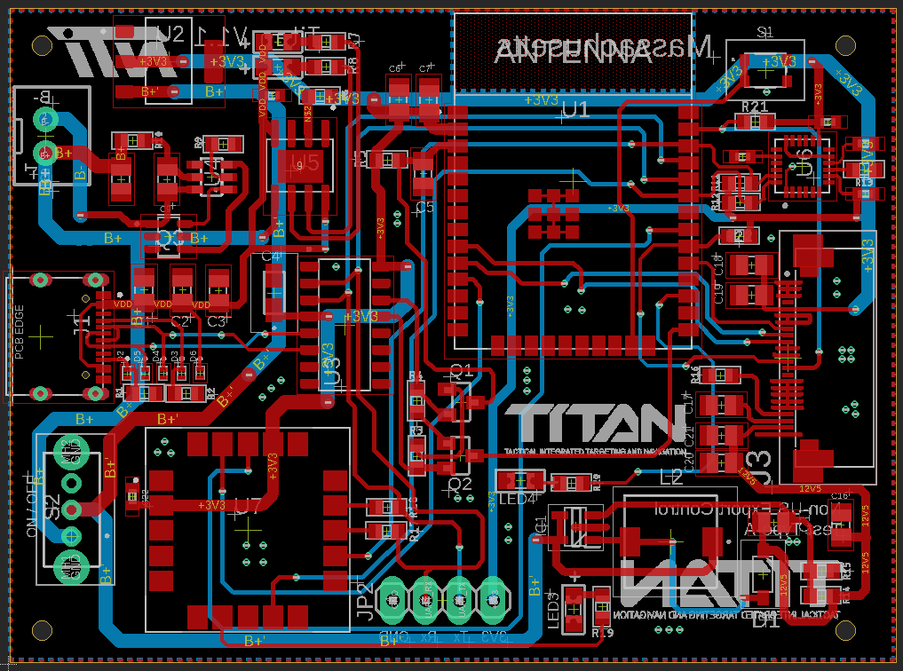

### 3D Rendering View
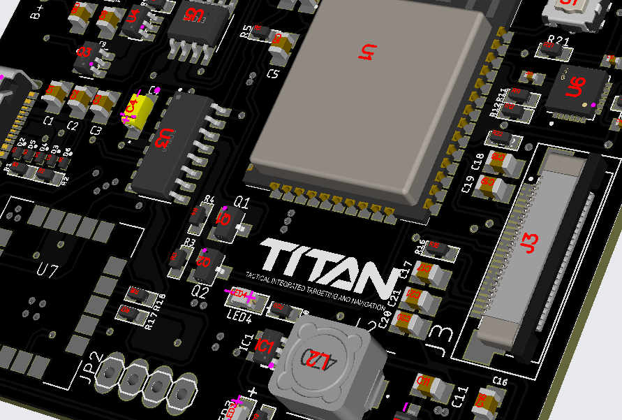

### Fabricated View

## Graphical User Interface Design
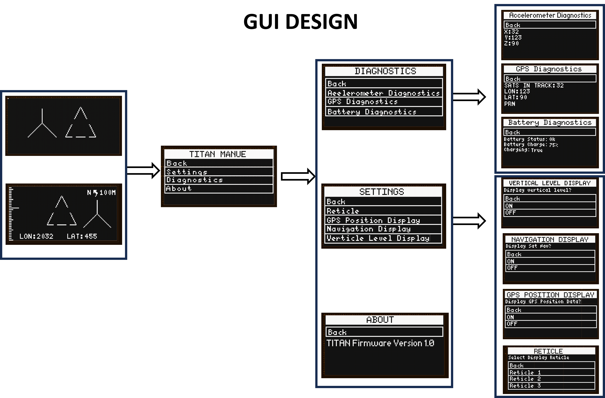
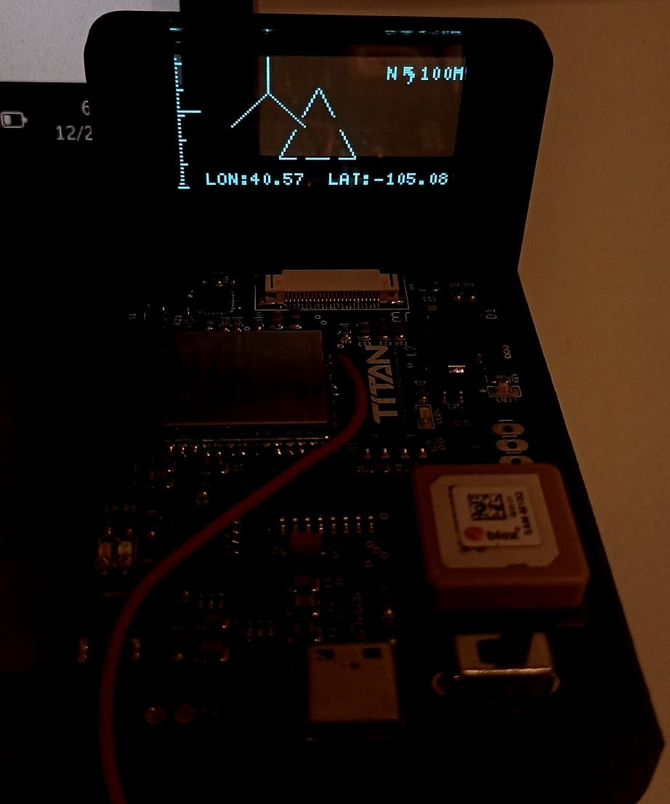
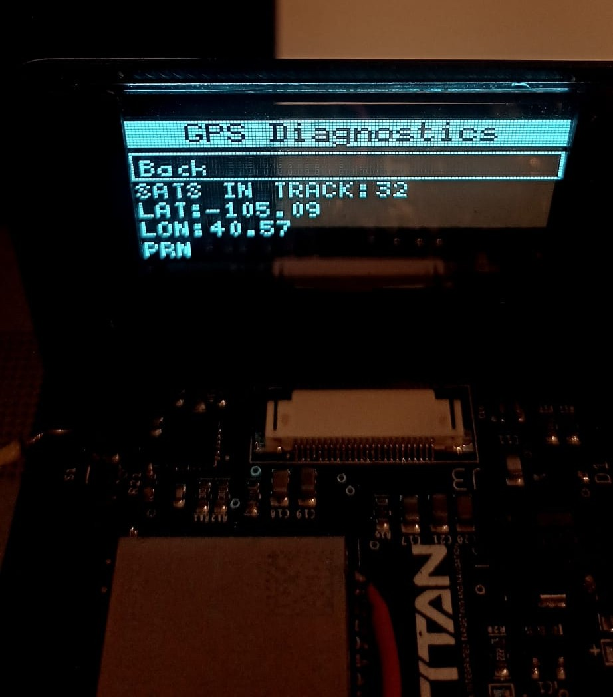
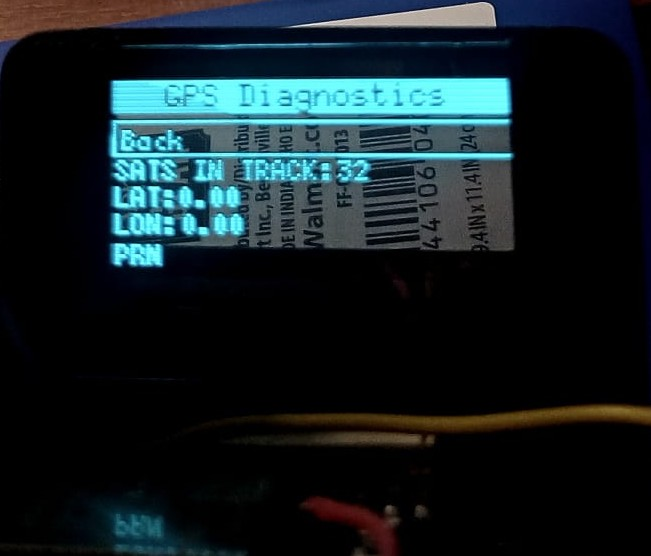

## Over-the-Air Web Interface Design
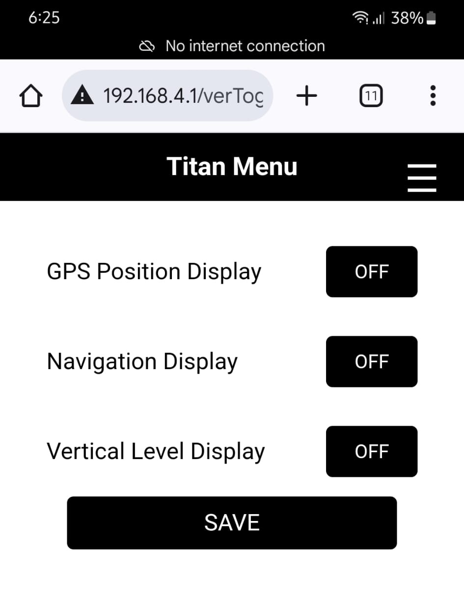
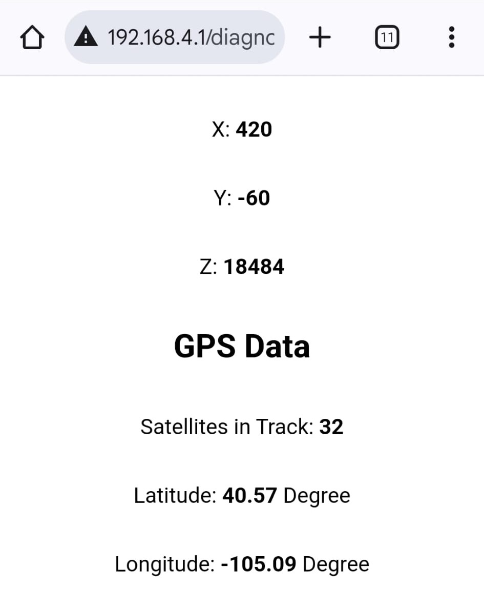

## Contributions
Contributions are welcome! If you have suggestions or improvements, feel free to fork this repository and submit a pull request.
