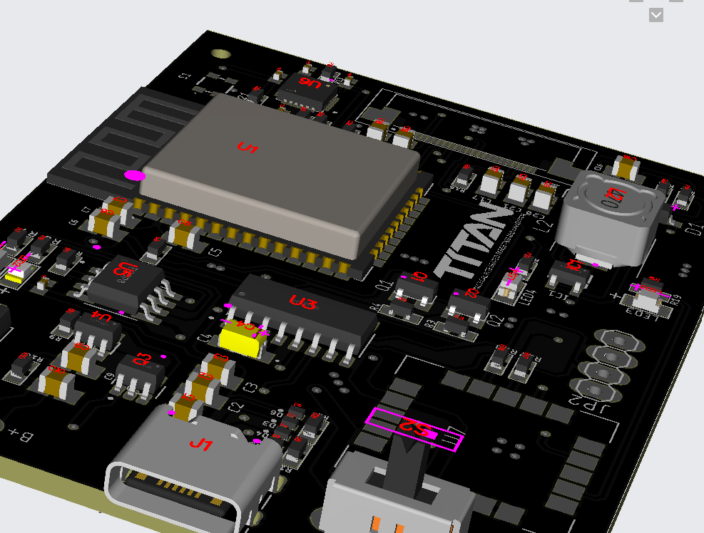

# TITAN: Augmented Reality Glass Plugin Board

## Project Overview
The AR Glass Plugin Board is an innovative solution designed to tranform any traditional glass to a AR based smart glass.

### Key Features:
1. **Energy Efficiency**: Achieved power consumption under 38 mW without sacrificing GNSS performance.
2. **Precision and Availability**: Ensured maximum position availability with four concurrent GNSS receptions using u-blox SAM-M10Q-00B.
3. **User-Centric Design**: Developed a minimalist GUI for an Tranparent Display for intuitive user experience.
4. **Advanced Detection**: Integrated precise movement detection using MPU 6050 gyrosensor for accurate performance.
5. **Robust Protection**: Implemented EMC/EMI immunity, reverse voltage, safe in-circuit charging, and ESD protection, along with overcharging protection to ensure reliability.
6. **OTA Updates**: Implemented a WiFi-based Over-the-Air firmware upgrade feature.
7. 

## PCB Design and Visuals

### Schematic


### PCB Layout


### 3D Rendering View



### Fabricated View


## Repository Structure
```
|-- README.md
|-- images
|   |-- schematic-image.png
|   |-- top-layer-image.png
|   |-- bottom-layer-image.png
|   |-- 3d-view-image.png
|-- pcb-design-files
    |-- project-files
```

## How to Use
1. Clone the repository to your local machine.
2. Open the schematic and PCB design files using your preferred EDA tool.
3. Review the design and adapt it to your specific use case.

## Contributions
Contributions are welcome! If you have suggestions or improvements, feel free to fork this repository and submit a pull request.

## License
This project is licensed under the MIT License. See the LICENSE file for details.
